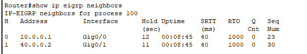
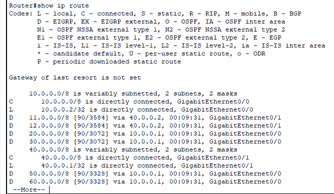
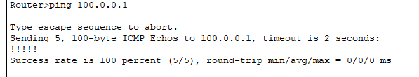
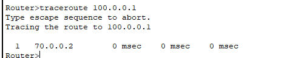

# Multi-Router EIGRP Routing Lab

## Project Overview

This project demonstrates the design, configuration and testing of a multi-router network using Cisco Packet Tracer.

EIGRP dynamic routing was implemented with Autonomous System 100 to allow multiple routers and networks to exchange routing information automatically.

The project focuses on practical routing configuration, EIGRP neighbor formation, route learning, connectivity verification and basic network troubleshooting.

---

## Objective

The objective of this project was to:

- Design a multi-router network
- Configure IPv4 addressing
- Configure EIGRP dynamic routing
- Establish EIGRP neighbor relationships
- Verify dynamically learned routes
- Test remote network connectivity
- Analyze packet paths using Traceroute
- Practice Cisco IOS verification and troubleshooting commands

---

## Technologies / Tools Used

- Cisco Packet Tracer
- Cisco 2911 Routers
- Cisco IOS CLI
- IPv4 Addressing
- EIGRP
- Ping
- Traceroute
- Git
- GitHub

---

## Lab Environment

This project was created and tested inside a controlled Cisco Packet Tracer environment for educational purposes.

The network contains multiple interconnected Cisco routers using different IPv4 networks.

### Routing Protocol

```text
EIGRP
```

### EIGRP Autonomous System

```text
100
```

---

## What I Did

During this project, I:

- Built a multi-router topology in Cisco Packet Tracer
- Connected multiple routers through different IPv4 networks
- Configured IPv4 addresses on router interfaces
- Enabled the required router interfaces
- Configured EIGRP AS 100
- Advertised connected networks through EIGRP
- Established EIGRP neighbor relationships
- Verified EIGRP-learned routes
- Checked interface and protocol status
- Tested remote connectivity using Ping
- Used Traceroute to verify the packet path
- Used Cisco IOS commands for verification and troubleshooting

---

## EIGRP Neighbor Verification

The following command was used:

```text
show ip eigrp neighbors
```

The command confirmed that EIGRP neighbor relationships were successfully established.

Example neighbors visible during verification included:

```text
10.0.0.1
40.0.0.2
```

A queue count of `0` was observed in the neighbor table, showing that the EIGRP adjacency was operating normally during the test.

### Evidence



---

## Routing Table Verification

The routing table was checked using:

```text
show ip route
```

The routing table contained directly connected networks as well as routes learned dynamically through EIGRP.

EIGRP-learned routes are identified by:

```text
D
```

Examples of dynamically learned networks observed in the routing table included:

```text
11.0.0.0/8
12.0.0.0/8
20.0.0.0/8
30.0.0.0/8
50.0.0.0/8
60.0.0.0/8
```

This confirmed that routing information was being exchanged successfully between the routers.

### Evidence



---

## Connectivity Test

Remote network connectivity was tested using:

```text
ping 100.0.0.1
```

The Ping test returned:

```text
!!!!!
Success rate is 100 percent (5/5)
```

This confirmed successful end-to-end connectivity to the remote destination.

### Evidence



---

## Traceroute Test

The packet path was verified using:

```text
traceroute 100.0.0.1
```

The observed path included:

```text
1   40.0.0.2
2   70.0.0.2
```

This showed the routers through which the packet travelled before reaching the remote destination.

The same verification screenshot also contains EIGRP neighbor information.

### Evidence



---

## Verification Commands

The following Cisco IOS commands were used during this lab:

```text
show ip eigrp neighbors
show ip route
show ip interface brief
show running-config | section router eigrp
ping 100.0.0.1
traceroute 100.0.0.1
```

---

## Results

The Multi-Router EIGRP Routing Lab was successfully configured and tested.

### Verified Results

- EIGRP AS 100 was configured
- EIGRP neighbors were successfully established
- Routers exchanged routing information dynamically
- EIGRP routes appeared in the routing table
- Remote connectivity was successful
- Ping achieved a 100% success rate
- Traceroute displayed the packet path
- Multi-router communication was successfully verified

---

## Project Evidence

The repository currently contains the following practical evidence:

### 1. EIGRP Neighbor Verification


### 2. Routing Table


### 3. Successful Ping Test


### 4. Traceroute and EIGRP Verification


---

## Learning Outcomes

Through this project, I learned:

- How EIGRP dynamic routing works
- How routers discover EIGRP neighbors
- How routers exchange routing information
- How to identify EIGRP routes in a routing table
- How to verify EIGRP adjacency
- How to test remote network connectivity
- How to use Ping for connectivity testing
- How to use Traceroute for path analysis
- How to read basic Cisco routing information
- How to perform basic routing troubleshooting
- How to document practical networking work on GitHub

---

## Troubleshooting Commands

The following commands are useful when troubleshooting this lab:

```text
show ip interface brief
show ip route
show ip eigrp neighbors
ping <destination-ip>
traceroute <destination-ip>
```

These commands help verify:

- Interface status
- IPv4 configuration
- EIGRP adjacency
- Learned routes
- Network reachability
- Packet path

---

## Future Improvements

The lab can be expanded in the future after practical implementation and testing.

Possible improvements include:

- VLAN configuration
- Inter-VLAN Routing
- DHCP
- DNS
- Access Control Lists
- Network segmentation
- Additional routing scenarios
- Redundant routing paths
- More advanced troubleshooting scenarios

Only features that are practically implemented and tested will be added to this repository.

---

## Security & Ethics

All networking and security experiments shown in this project were performed in a controlled Cisco Packet Tracer lab environment for educational purposes.

No unauthorized network, server, website, wireless network, system or device was tested.

---

## Project Status

```text
Project: Multi-Router EIGRP Routing Lab
Environment: Cisco Packet Tracer
Routing Protocol: EIGRP
Autonomous System: 100
Neighbor Verification: Successful
Dynamic Route Learning: Successful
Ping Test: 100% Successful
Traceroute Test: Successful
Status: Completed
```

---

## Author

**Pintu Aryan**

Aspiring Cyber Security Analyst

Networking | Python | Security Operations

### GitHub Profile

https://github.com/pintuaryan8973-source

### Project Repository

https://github.com/pintuaryan8973-source/01-multi-router-eigrp-lab
